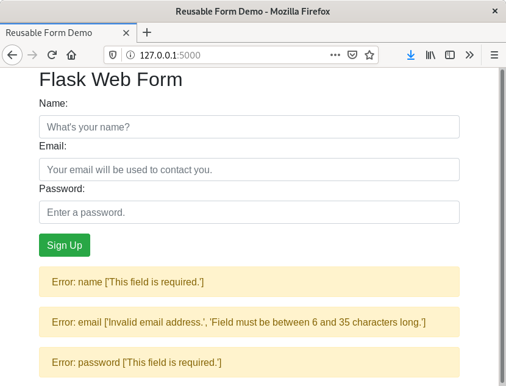

Flask + WTForms + Kubernetes Deployment
=======================================

# Test locally (Python)
```bash
pip3 install -r requirements.txt
python3 app.py
# Browse to http://127.0.0.1:5000/
```


# Demo Screenshot



